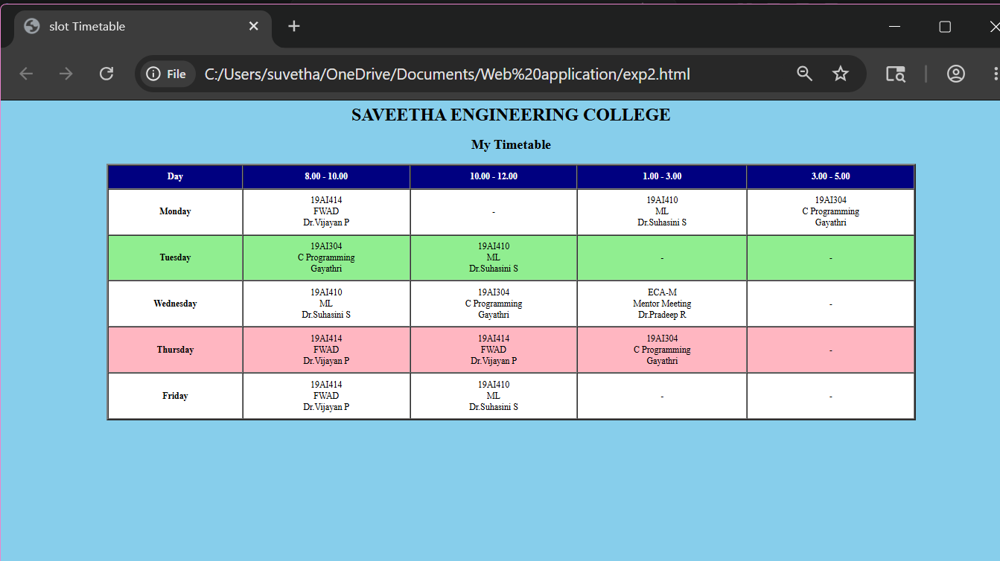

# Ex02 Time Table
## Date:

## AIM
To write a html webpage page to display your slot timetable.

## ALGORITHM
### STEP 1
Create a Django-admin Interface.

### STEP 2
Create a static folder and inert HTML code.

### STEP 3
Create a simple table using ```<table>``` tag in html.

### STEP 4
Add header row using ```<th>``` tag.

### STEP 5
Add your timetable using ```<td>``` tag.

### STEP 6
Execute the program using runserver command.

## PROGRAM
```
<html>

<head>
    <title>slot Timetable</title>
</head>

<body bgcolor="skyblue">
<center>
    <h1>SAVEETHA ENGINEERING COLLEGE</h1>
    <h2>My Timetable</h2>
    <table border="3" cellpadding="10" cellspacing="1" width="80%">
        <tr bgcolor="Navy">
            <th><font color="White">Day</font></th>
            <th><font color="White">8.00 - 10.00</font></th>
            <th><font color="White">10.00 - 12.00</font></th>
            <th><font color="White">1.00 - 3.00</font></th>
            <th><font color="White">3.00 - 5.00</font></th>
        </tr>
        <tr align="center" bgcolor="White">
            <td><b>Monday</b></td>
            <td>19AI414 <br>FWAD <br>Dr.Vijayan P</td>
            <td>-</td>
            <td>19AI410 <br>ML <br>Dr.Suhasini S</td>
            <td>19AI304 <br>C Programming <br>Gayathri</td>
        </tr>
        <tr align="center" bgcolor="LightGreen">
            <td><b>Tuesday</b></td>
            <td>19AI304 <br>C Programming <br>Gayathri</td>
            <td>19AI410 <br>ML <br>Dr.Suhasini S</td>
            <td>-</td>
            <td>-</td>
        </tr>
        <tr align="center" bgcolor="White">
            <td><b>Wednesday</b></td>
            <td>19AI410 <br>ML <br>Dr.Suhasini S</td>
            <td>19AI304 <br>C Programming <br>Gayathri</td>
            <td>ECA-M <br>Mentor Meeting <br>Dr.Pradeep R</td>
            <td>-</td>
        </tr>
        <tr align="center" bgcolor="LightPink">
            <td><b>Thursday</b></td>
            <td>19AI414 <br>FWAD <br>Dr.Vijayan P</td>
            <td>19AI414 <br>FWAD <br>Dr.Vijayan P</td>
            <td>19AI304 <br>C Programming <br>Gayathri</td>
            <td>-</td>
        </tr>
        <tr align="center" bgcolor="White">
            <td><b>Friday</b></td>
            <td>19AI414 <br>FWAD <br>Dr.Vijayan P</td>
            <td>19AI410 <br>ML <br>Dr.Suhasini S</td>
            <td>-</td>
            <td>-</td>
        </tr>
    </table>
</center>
</body>
</html>
```
## OUTPUT


## RESULT
The program for creating slot timetable using basic HTML tags is executed successfully.
